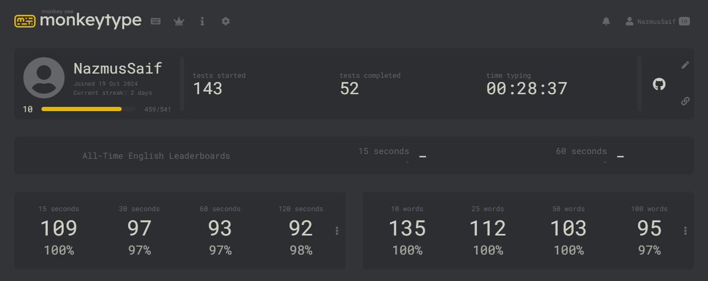

<h1 align="center">
  
</h1>

<h3 align="center">UI-focused full-stack developer skilled in React.js, Node.js, Express.js, Python, FastAPI, MongoDB, and PostgreSQL. Enthusiastic about ML, AI, and building AI agents with LLMs. Passionate about learning and tackling new challenges.</h3>

<h4 align="center">
  <code><a href="https://www.linkedin.com/in/nzsaif/" title="LinkedIn Profile"> LinkedIn</a></code>
  <code><a href="https://www.hackerrank.com/nazmussaif_cse" title="HackerRank Profile"> HackerRank</a></code>
  <code><a href="https://leetcode.com/u/Nazmus_Saif/" title="LeetCode Profile"> LeetCode</a></code>
  <code><a href="https://codeforces.com/profile/NSaif" title="Codeforces Profile"> Codeforces</a></code>
  <code><a href="https://vjudge.net/user/NSaif" title="VJudge Profile"> VJudge</a></code>
</h4>

### 🧐 More About Me:

- 🔭 &nbsp; <em>Software Engineer I at <a href="https://brainstation-23.com/?1">**Brain Station 23**</a></em>
- 🌱 &nbsp; I’m currently learning **Django**
- 💬 &nbsp; My [Portfolio](https://nazmussaif.vercel.app/)!.
- 📫 &nbsp; Reach me out: **nzsaif10@gmail.com**
- 📝 &nbsp; Checkout my [Resume](https://drive.google.com/file/d/1x7qi3u1SGGPB0Gth1t0zQRie8XoeXYFM/view?usp=drive_link)

### ☺️ Favorite Things:

- 💻 &nbsp; I love exploring new technologies and building cool stuff.
- 📰 &nbsp; Reading, writing & watching Tech Stuff whenever possible.
- 🎮 &nbsp; I Love to play cricket and caroom.

<h2 align="center" id="nzsaif-tech">🔥 Languages, Frameworks, Libraries, & Tools 🔥</h2>

> Tools and technologies that I have worked with.

<table align="center">
  <tr>
    <td align="center" width="96">
      
       AI
    </td>
    <td align="center" width="96"> 
      
       Python
    </td>
    <td align="center" width="96">
      
       Tensorflow
    </td>
    <td align="center" width="96">
    
     Keras
    </td>
    <td align="center" width="96">
      
       SK-Learn
    </td>
    <td align="center" width="96">
      
       Pandas
    </td>
    <td align="center" width="96">
      
       Numpy
    </td>
    <td align="center" width="96">
      
       Matplotlib
    </td>
    <td align="center" width="96">
      
       Seaborn
    </td>
  </tr>
  <tr>
    <td align="center" width="96">
      
       C++
    </td>
    <td align="center" width="96">
      
       HTML
    </td>
    <td align="center" width="96">
      
       CSS
    </td>
    <td align="center" width="96">
      
       JavaScript
    </td>
    <td align="center" width="96">
      
       ReactJS
    </td>
    <td align="center" width="96">
      
       ExpressJS
    </td>
    <td align="center" width="96">
      
       NodeJS
    </td>
    <td align="center" width="96">
      
       MongoDB
    </td>
      <td align="center" width="96">
      
       PostgreSQL
    </td>
  </tr>
  <tr>
    <td align="center" width="96">
      
       MySQL
    </td>
    <td align="center" width="96"> 
      
       PHP
    </td>
    <td align="center" width="96"> 
      
       FastAPI
    </td>
    <td align="center" width="96">
      
       Bootstrap
    </td>
    <td align="center" width="96">
      
       Tailwind
    </td>
    <td align="center" width="96"> 
      
       Git
    </td>
    <td align="center" width="96"> 
      
       Github
    </td>
    <td align="center" width="96"> 
      
       Selenium
    </td>
    <td align="center" width="96"> 
      
       Arduino
    </td>
  </tr>
</table>

> Tools and technologies that I am want to learn.

<table align="center">
  <tr>
  <td align="center" width="96">
      
       Go
    </td>
    <td align="center" width="96">
      
       Figma
    </td>
    <td align="center" width="105">
      
       Docker
    </td>
    <td align="center" width="96">
      
       AWS
    </td>
    <td align="center" width="96">
      
       Azure
    </td>
  </tr>
</table>

<h2 align="center" id="nzsaif-tech">🔥 Activities 🔥</h2>

<table>
  <tr>
    <td>
      
    </td>
  </tr>
</table>

<h4 align="center">
  <code><a href="" target="_blank">As an Engineer You Don't Need to Know Everything You Just Need to Know Where to Find it When You Need it.</a></code>
</h4>
